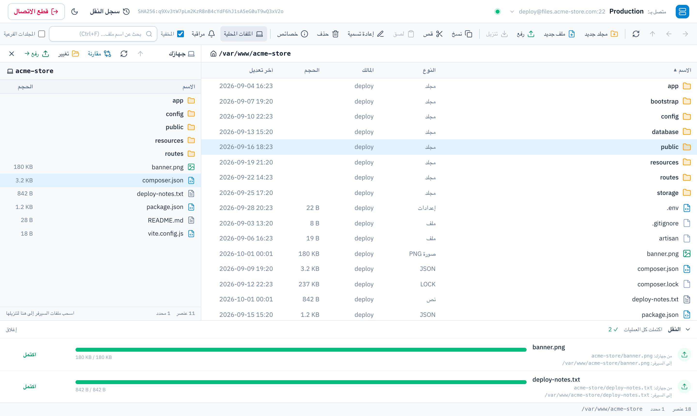
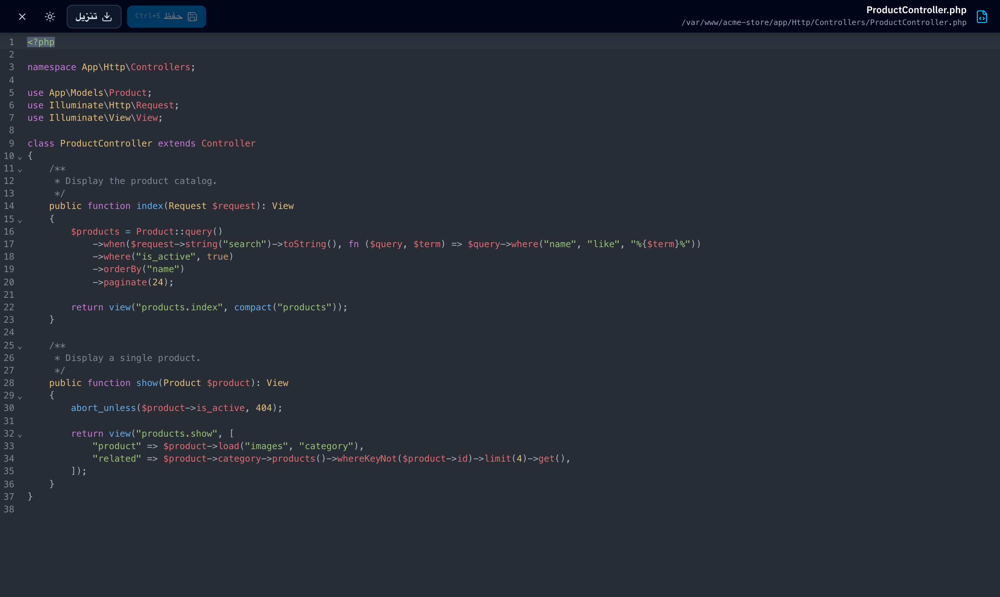

# SFTP Manager

A fast, modern file manager for your SFTP servers — right in the browser.
Runs locally on your computer, no database, no accounts.



## Features

- **Browse & manage files** — open, create, rename, copy, move and delete files and folders
- **Upload & download** — drag and drop files or whole folders, with progress and automatic resume
- **Built-in code editor** — syntax highlighting, search and safe saving
- **Archives** — browse ZIP and TAR files, extract them on the server, compress files or download folders as ZIP
- **Local & remote side by side** — work with files on your computer and on the server in one window
- **Compare & sync** — upload only what changed between a local folder and the server
- **Folder watch** — get notified when new files arrive
- **Multiple servers** — save your servers and switch between them in one click
- **SSH keys or password** — with server fingerprint verification
- **Privacy first** — passwords and keys are never stored; everything stays on your computer
- **Arabic RTL interface** with light and dark themes



## Quick start

No installation needed — just download and run.

1. Download **SFTP-Manager.zip** from the [latest release](../../releases/latest) and extract it.
2. Start it:
   - **macOS** — double-click `Start SFTP Manager.command`
     (the first time: right-click → *Open* → *Open*)
   - **Windows** — double-click `Start SFTP Manager (Windows).bat`
   - **Linux** — run `./start.sh`
3. Your browser opens automatically. Enter your server details and connect.

The first launch downloads the runtime once (internet required). The app is only reachable from your own computer.

## Run from source

**Requirements:** PHP 8.3+, Composer, Node.js 20+

```bash
git clone https://github.com/sohaibalaqad/SFTP-Manager.git
cd SFTP-Manager

composer install
cp .env.example .env
php artisan key:generate

npm install
npm run build

php artisan octane:install --server=frankenphp
php artisan octane:start --server=frankenphp --caddyfile=Caddyfile --host=127.0.0.1 --port=8010
```

Then open **http://127.0.0.1:8010**.

To build the ready-to-run package yourself:

```bash
php artisan app:package
```

## Security

- Credentials are kept only for the current session, encrypted, and removed when you disconnect.
- The server's fingerprint is confirmed before any password or key is sent.
- All file operations stay inside the folder you connect to.
- The app listens on `127.0.0.1` only.

## Built with

Laravel · Laravel Octane (FrankenPHP) · phpseclib · Alpine.js · Tailwind CSS · CodeMirror
